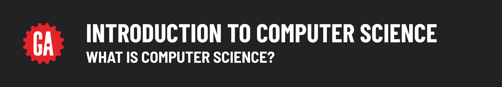
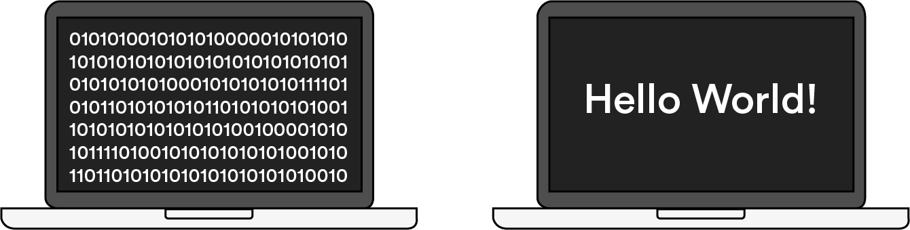

# 

## What Is Computer Science, Anyway?

*Transcript*

Computer science is really a discipline study of problem solving. We have a problem, that problem exists in a context with constraints, and we need some formal way of solving it.

Computer science is the art of using engineering and scientific methods to understand and leverage computers and technology.

Computer science is studying how to actually tell a computer how to do things. This looks different in a lot of different formats, but usually what we're talking about is about data structures, algorithms, how computers work, security, and all those things.

I think computer science is more the theory behind why certain aspects of programming are better or worse than other aspects, why best practices have been established, why those best practices are considered best practices. It's really the theory behind the application.

*end of transcript*

## Defining Computer Science

It’s a bit unfortunate that computer science has the word “computer” in its name, because it has many applications beyond just what we think of as a “computer.”

Instead, think of computer science as the study of the nature of computation; in other words, the study of problems, standardized solutions to those problems, and how to make those solutions more efficient.

## Layers of Abstraction

Computer science is, by definition, an abstract field of study.

Does “abstraction” feel like an abstract concept? Think about it this way: When you drive a car, you’re putting your key in the ignition, using the accelerator and brake pedals, and monitoring the speed and fuel gauges so that it runs. You’re dealing with the car’s operating system in the abstract, using tools that its manufacturers designed to make driving simple and easy.

On the other hand, the mechanic who works on your car has to understand how the ignition connects to the engine, how the pedals actually make the car move, and everything else that happens “under the hood.” The mechanic is cutting through layers of abstraction to get down to the car’s physical operations.

## In Programming Terms...

The way that most people use computers — sending emails, browsing websites, creating documents — is like sitting in the driver’s seat of a car. Even writing code and building web applications is similarly abstract. You’re using functions, tools, and languages created by other engineers to make cool stuff.

Computer science studies all of the “under the hood” mechanics of computers that most people don’t think about. What actually is a programming language? Isn’t it crazy that they can be read across so many different machines? And how do you get from binary 0s and 1s to what you see on your screen?

In computer science, we’re cutting through those layers of abstraction down to how stuff really works.

## Finding Yourself in CS

At this point, you might be wondering, “Where does computer science fit in with what I know about web development?”

We’ll be straight with you: Computer science deals mostly with parts of the tech stack you may not be interacting with all that much. Most of the programming you’re doing — building applications and websites that users interact with — sits at higher levels in the stack.

But computer science comes into play much lower in the stack, when you’re thinking about interactions between a database, a server, and your operating system.

## What's In It For Me?

So, if you most likely won’t be working with computer science concepts all that much, why should you learn about them?

It’s a legitimate question! From our perspective, there are two vitally important reasons to learn (at least a bit) about computer science:

- It makes you a more well-rounded software engineer.
- It comes up all the time in technical job interviews.

Let’s see what our SEB instructors have to say.

 

*Transcript*

In the next 10 years, everybody's going to need to know how to write a program in any capacity, either to protect yourself or for security purposes in your home. Since we're creating this huge ecosystem of smart home, smart everything, we will need to know how to navigate through it. The value of computer science is tenfold in the times that we're living in right now.

Most of your life, most of your career is going to be focused on solving problems. Computer science, as a formal discipline of studying problem solving, is going to help you do that.

When you really dive into the weeds and you want to build something truly new - which you have the ability to do as a software engineer - computer science is what allows you to get there through code.

Learning computer science should be not just valuable on the job, but on a personal level, it can enable you to pursue things that you love. If you have a passion project, you're really passionate about helping stray animals in your neighborhood and you want to build this app to connect them with these different groups, you then have the power to do that. Or you want to build something for your family because you have a family event coming up. It goes beyond just work, and it's actually helping you put your ideas into action, and it can be empowering to be solving problems and thinking critically like that.

*end of transcript*

## Let’s Talk About Interviews

You may have already heard stories of the infamous whiteboarding components of engineering job interviews, where you’re given a question and asked to draw out a solution on the spot. Oftentimes, those questions relate to computer science. If just reading this sentence strikes fear in your heart, you’re not alone.

Here are the sorts of CS questions you might encounter in a job interview. (Spoiler alert: You may not know what all of these questions are about, but by the end of this computer science unit, you will!)

## Why CS?

The fundamentals of computer science are a popular interview topic for a couple of reasons:

- They show that you know and care about the world of programming.
- They’re a great way for interviewers to understand how you approach a problem.

Let's hear about what interviewers are looking for when they ask candidates about computer science.

## What Interviewers Are Looking For

*Transcript*

A lot of times when hiring managers are asking whiteboarding questions about data structures or underlying algorithms or computer science topics, or even object oriented programming, it's because they're trying to tease out knowledge and ability to learn and how much the person has the foundations of programming. Those concepts are not in any particular language; they're not tied to any particular language. So, do you know the concept? Can you do this job?

They're trying to see your problem solving skills and what you do know. Some of these problems you may actually see in person as well. Part of it is really difficult because at work, you're going to have Google, and you can always look these things up, but they're trying to filter out problem solving skills with the whiteboarding and talking about algorithms and all that.

Essentially, these interview questions aren't asking if you are an expert at algorithms or data structures. They are asking if you are able to deal with a problem, how will you go about it, and what tools do you have in your bag to be able to fix this problem?

It's not always just about getting the right answer. Sometimes, if you know the right answer off the top of your head, that's actually a negative, because you might skip walking through the thought process and how to solve it, which is really what they're looking for.

*end of transcript*

## No Code Allowed

Luckily for you, prepping for computer science interview questions doesn’t require memorizing long lines of code. As some of the instructors mentioned, you’ll typically be expected to draw out your approach to a problem on a whiteboard.

A lot of algorithms and data structures can easily be explained visually without any code. You’ll need to understand how they work on a conceptual level in order to successfully answer these interview questions.

The best part? Whiteboarding is easy to practice and learn!

## Looking Ahead

Computer science is a vast discipline that covers topics ranging from the theory of programming languages to computer system architecture. It would be impossible to cover all of it here!

Instead, we’ll focus on the principles of computing — in other words, how computers approach and solve problems. The two important factors here are:

- **Algorithms**, or step-by-step processes for solving a problem.
- **Data structures**, or the way that information is organized in order to solve a problem.

Algorithms and data structures are two areas of computer science that come up frequently in technical interviews. The concepts we’ll cover here are ones that you may be asked to think through and whiteboard out.

## More Resources

Want to learn more about the science of computers? Check out these blogs and video series:

- Harvard University's [CS50 video series](https://www.youtube.com/channel/UCcabW7890RKJzL968QWEykA).
- Hacker Rank's [Algorithms](https://www.youtube.com/playlist?list=PLI1t_8YX-ApvMthLj56t1Rf-Buio5Y8KL) and [Data Structures](https://www.youtube.com/playlist?list=PLI1t_8YX-Apv-UiRlnZwqqrRT8D1RhriX) video series.
