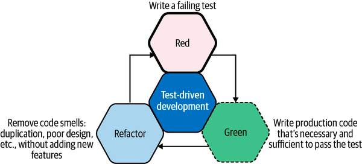

#  Python Unit Testing - Part 2

## Objectives

*After this lesson, students will be able to:*

- Explain the importance of TDD
- Become familiar with TDD's three phases
- Understand that edge cases are at the limit of the function’s behavior
- Understand that corner cases are where two edge cases meet

### What is TDD (Test Driven Development)?

Test-driven development follows a three-phase process:

- **Red**. We write a failing test (including possible compilation failures). We run the test suite to verify the failing tests.
- **Green**. We write just enough production code to make the test green. We run the test suite to verify this.
- **Refactor** (Blue). We remove any code smells. These may be due to duplication, hardcoded values, or improper use of language idioms (e.g., using a verbose loop instead of a built-in iterator). If we break any tests during refactoring, we prioritize getting them back to green before exiting this phase.


The three phases of this cycle are the essential building blocks of test-driven development.<br/><br/>

Note : TDD is a perfect match for the ideals and principles of the Agile Development process, with a great striving to deliver incremental updates to a product with true quality, as opposed to quantity. The confidence in your individual units of code that unit testing provides means that you meet this requirement to deliver quality, while eradicating issues in your production environments.

### Agile Development With Test-Driven Development

TDD comes into its own when pair programming, however. The ability to mix up your development workflow, when working as a pair as you see fit, is nice. For example, one person can write the unit test, see it pass, and then allow the other developer to write the code to make the test pass.

### Syntax for Unit Testing

There is a list of assert statements available
on [this page](https://docs.python.org/3/library/unittest.html#assert-methods) that you can use as per your
requirements. Below is a list of some of the most common assert statements.

| Method                      | Checks for               |
|-----------------------------|--------------------------|
| `assertEqual(a, b)`         | a `==` b                 |
| `assertNotEqual(a, b)`      | a `!=` b                 |
| `assertTrue(x)`             | `bool(x)` `is` `True`    |
| `assertFalse(x)`            | `bool(x)` `is` `False`   |
| `assertIs(a, b)`            | a `is` b                 |
| `assertIsNot(a, b)`         | a `is` `not` b           |
| `assertIsNone(x)`           | x `is` `None`            |
| `assertIsNotNone(x)`        | x `is` `not` `None`      |
| `assertIn(a, b)`            | a `in` b                 |
| `assertNotIn(a, b)`         | a `not` `in` b           |
| `assertIsInstance(a, b)`    | `isinstance(a, b)`       |
| `assertNotIsInstance(a, b)` | `not` `isinstance(a, b)` |

### Useful CLI options

- `-v` gives more verbose output, including the names of the tests being executed.
- `-s` or `-nocapture` allows output of print statements, which are normally captured and hidden while executing tests.
  Useful for debugging.
- `--nologcapture` allows output of logging information.
- `--rednose` an optional plugin, which can be downloaded here, but provides colored output for the tests.
- `--tags=TAGS` allows you to place an `@TAG` above a specific test to only execute those, rather than the entire test
  suite.

### Example Problem and Test-Driven Approach

We are going to take a look at a really simple example to introduce both unit testing in Python and the concept of TDD. We will write a very simple calculator class, with add, subtract and other simple methods as you would expect.<br/><br/>

Following a TDD approach, let's say that we have a requirement for an `add` function, which will determine the sum of two numbers, and return the output. Let's write a failing test for this. To get started, Create a file named `test_calculator.py` in the `test` directory with the following contents.

```python
# test/test_calculator.py

import unittest


class TddInPythonExample(unittest.TestCase):

    def test_calculator_add_method_returns_correct_result(self):
        calc = Calculator()
        result = calc.add(2, 2)
        self.assertEqual(4, result)

if __name__ == '__main__':
    unittest.main()
```

**OUTPUT**
````text
(venv) Sureshs-MBP:python-unit-testing-2 suresh$ nose2
E
======================================================================
ERROR: test_calculator_add_method_returns_correct_result (test.test_calculator.TestCalculator)
----------------------------------------------------------------------
Traceback (most recent call last):
  File "/Users/suresh/Documents/ga/python-unit-testing-2/test/test_calculator.py", line 7, in test_calculator_add_method_returns_correct_result
    calc = Calculator()
NameError: name 'Calculator' is not defined

----------------------------------------------------------------------
Ran 1 test in 0.000s

FAILED (errors=1)
````

From the output we can see that the problem relates to us not importing `Calculator` class. That's because we haven't created it yet! So let's go and define our Calculator in a file named `calculator.py` under the `src` directory and import it:

```python
# src/calculator.py

class Calculator:

    def add(self, x, y):
        pass

```

```python
# test/test_calculator.py

import unittest
from src.calculator import Calculator


class TestCalculator(unittest.TestCase):

    def test_calculator_add_method_returns_correct_result(self):
        calc = Calculator()
        result = calc.add(2, 2)
        self.assertEqual(4, result)


if __name__ == '__main__':
    unittest.main()

```

Now that we have Calculator defined, let's see the output now:

```text
(venv) Sureshs-MBP:python-unit-testing-2 suresh$ nose2
F
======================================================================
FAIL: test_calculator_add_method_returns_correct_result (test.test_calculator.TestCalculator)
----------------------------------------------------------------------
Traceback (most recent call last):
  File "/Users/suresh/Documents/ga/python-unit-testing-2/test/test_calculator.py", line 10, in test_calculator_add_method_returns_correct_result
    self.assertEqual(4, result)
AssertionError: 4 != None

----------------------------------------------------------------------
Ran 1 test in 0.000s

FAILED (failures=1)
```

So, obviously, our add method is returning the wrong value, as it doesn't do anything at the moment. Thankfully, the error gives us the offending line in the test, and we can then confirm what we need to change. Let's fix the method and see if our test passes now:

```python
class Calculator:

    def add(self, x, y):
        return x + y

```

```text
(venv) Sureshs-MBP:python-unit-testing-2 suresh$ nose2
.
----------------------------------------------------------------------
Ran 1 test in 0.000s

OK

```

Success! We have defined our add method, and it works as expected. However, there is more work to do around this method to ensure that we have tested it properly.

What would happen if someone were to add anything other than numbers? Python will actually allow for the addition of strings and other types, but in our case, for our calculator, it makes sense to only allow adding of numbers. Let's add another failing test for this case, making use of the assertRaises method to test if an exception is raised here:

```python
# test/test_calculator.py

import unittest
from src.calculator import Calculator


class TestCalculator(unittest.TestCase):

    def setUp(self):
        self.calc = Calculator()

    def test_calculator_add_method_returns_correct_result(self):
        result = self.calc.add(2, 2)
        self.assertEqual(4, result)

    def test_calculator_returns_error_message_if_both_args_not_numbers(self):
        self.assertRaises(ValueError, self.calc.add, 'two', 'three')


if __name__ == '__main__':
    unittest.main()

```

You can see from above that we added the test and are now checking for a ValueError to be raised, if we pass in strings. We could also add more checks for other types, but for now, we'll keep things simple. You may also notice that we've made use of the `setup()` method. This allows us to put things in place before each test case. So, as we need our `Calculator` object to be available in both test cases, it makes sense to initialize this in the setUp method.

```text
(venv) Sureshs-MBP:python-unit-testing-2 suresh$ nose2
.F
======================================================================
FAIL: test_calculator_returns_error_message_if_both_args_not_numbers (test.test_calculator.TestCalculator)
----------------------------------------------------------------------
Traceback (most recent call last):
  File "/Users/suresh/Documents/ga/python-unit-testing-2/test/test_calculator.py", line 15, in test_calculator_returns_error_message_if_both_args_not_numbers
    self.assertRaises(ValueError, self.calc.add, 'two', 'three')
AssertionError: ValueError not raised by add

----------------------------------------------------------------------
Ran 2 tests in 0.000s

FAILED (failures=1)

```

Clearly, the error indicates to us that we are not raising the `ValueError` when we expect to be. Now that we have a new failing test, we can code the solution to make it pass.

```python
# src/calculator.py

class Calculator:

    def add(self, x, y):
        number_types = (int, float, complex)

        if isinstance(x, number_types) and isinstance(y, number_types):
            return x + y
        else:
            raise ValueError

```

From the code above, you can see that we've added a small addition to check the types of the values and whether they match what we want. One approach to this problem could mean that you follow duck typing, and simply attempt to use it as a number, and `try/except` the errors that would be raised in other cases. The above is a bit of an edge case and means we must check before moving forward. As mentioned earlier, strings can be concatenated with the plus symbol, so we only
want to allow numbers. Utilising the is instance method allows us to ensure that the provided values can only be numbers.<br/><br/>

To complete the testing, there are a couple of different cases that we can add. As there are two variables, it means that both could potentially not be numbers. Add the test case to cover all the scenarios.

```python
# test/test_calculator.py

import unittest
from src.calculator import Calculator


class TestCalculator(unittest.TestCase):

    def setUp(self):
        self.calc = Calculator()

    def test_calculator_add_method_returns_correct_result(self):
        result = self.calc.add(2, 2)
        self.assertEqual(4, result)

    def test_calculator_returns_error_message_if_both_args_not_numbers(self):
        self.assertRaises(ValueError, self.calc.add, 'two', 'three')

    def test_calculator_returns_error_message_if_x_arg_not_number(self):
        self.assertRaises(ValueError, self.calc.add, 'two', 3)

    def test_calculator_returns_error_message_if_y_arg_not_number(self):
        self.assertRaises(ValueError, self.calc.add, 2, 'three')


if __name__ == '__main__':
    unittest.main()

```

When we run all these tests now, we can confirm that the method meets our requirements!

```text
(venv) Sureshs-MBP:python-unit-testing-2 suresh$ nose2
....
----------------------------------------------------------------------
Ran 4 tests in 0.000s

OK

```

### Edge Cases

The situation where the test examines either the beginning or the end of a range, but not the middle, is called an edge case. In a simple, one-dimensional problem, the two edge cases should always be tested along with at least one internal point. This ensures that you have good coverage over the range of values.

Anecdotally, it is important to test edges cases because this is where errors tend to arise. Qualitatively different behavior happens at boundaries. As such, they tend to have special code dedicated to them in the implementation.

Consider the following simple Fibonacci function:

```python
def fib(n):
    if n == 0 or n == 1:
        return n
    else:
        return fib(n - 1) + fib(n - 2)
```

This function has two edge cases: zero and one. For these values of n, the `fib()` function does something special that does not apply to any other values. Such cases should be tested explicitly. A minimally sufficient test suite for this function (assuming the fib function is in a file called `mod.py`) would be:

```python
from mod import fib


def test_fib0():
    # test edge 0
    obs = fib(0)
    assert obs == 0


def test_fib1():
    # test edge 1
    obs = fib(1)
    assert obs == 1


def test_fib6():
    # test internal point
    obs = fib(6)
    assert obs == 8
```

Different functions will have different edge cases. Often, you need not test for cases that are outside the valid range, unless you want to test that the function fails. In the `fib()` function negative and noninteger values are not valid inputs. Tests for these classes of numbers serve you well if you want to make sure that the function fails as expected. Indeed, we learned in the assertions section that this is actually quite a good idea.

### Further Reading

This section provides more resources on the topic if you are looking to go deeper.

- [What is Test Driven Development (TDD)? Tutorial with Example](https://www.guru99.com/test-driven-development.html)
- [Test Driven Development (TDD) in Agile : Steps and Benefits](https://staragile.com/blog/test-driven-development)
