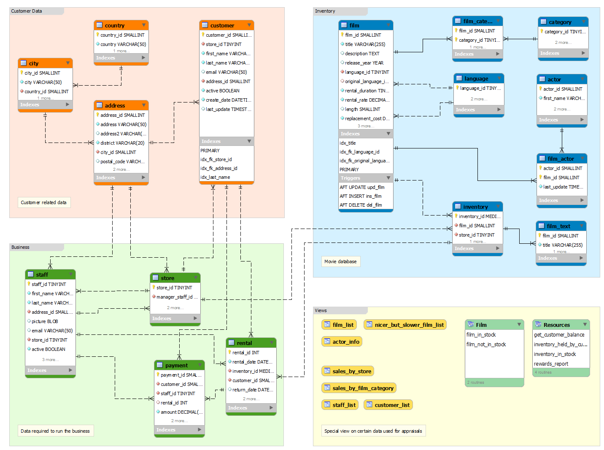

## Morning Activity - Join Challenges! 

This morning our amazing chica, Cynthia, will challenge you to some SQL joins so we can have some fun while testing and learning more about SQL!

## Instructions

Using the **Sakila** database, complete the **8 SQL queries** listed below.  
You’ll need to use different types of **JOINs** to solve them.  

Here’s the ERD (Entity Relationship Diagram) to help you:  

  

## Setup
Follow these steps to get everything ready:  

1. **Navigate to this folder** in your terminal.  
2. **Create the database** `sakila_pg`:  
   ```bash
   psql -f pagila-schema.sql
3. Load the sample data:
   ```bash
   psql -f pagila-data.sql
4. Write your solutions in a file named `solution.sql`.
5. Run your queries with one of the following:
    1. From your terminal: ``psql -f solution.sql``
    2. From inside the psql shell: ``\i solution.sql``
    3. Make sure you're either connected in psql shell (``psql -d sakila_pg``) or start your file with ``\connect sakila_pg``;
6. Exit the `psql` shell with: `\q`.

## Queries
1. Get the name, last name, email, and address of all customers located in the city ‘Santiago de los Caballeros’.
2. Get the film title, description, release year, rating, special features, and genre (category) for all movies in the 'Sci-Fi' category.
3. Get the actor ID, actor name, film title, description, and release year for all movies featuring the actress ‘WHOOPI’.
4. Get the name, last name, email, and address of all customers from store_id = 1 who live in cities with IDs 1, 42, 312, and 459.
5. Get the film title, description, release year, rating, and special feature for movies with rating = 'PG-13', including 'Trailers' in special_features, and featuring actor_id = 23.
6. Get the film_id, title, actor_id, and actor name for all actors who participated in film_id = 157.
7. Get the film title, description, release year, rating, special features, and genre for all 'Horror' movies with a rental_rate of 0.99.
8. Get the film title, description, release year, rating, special features, genre, and actor name for all 'Music' movies featuring 'VAL BOLGER'.