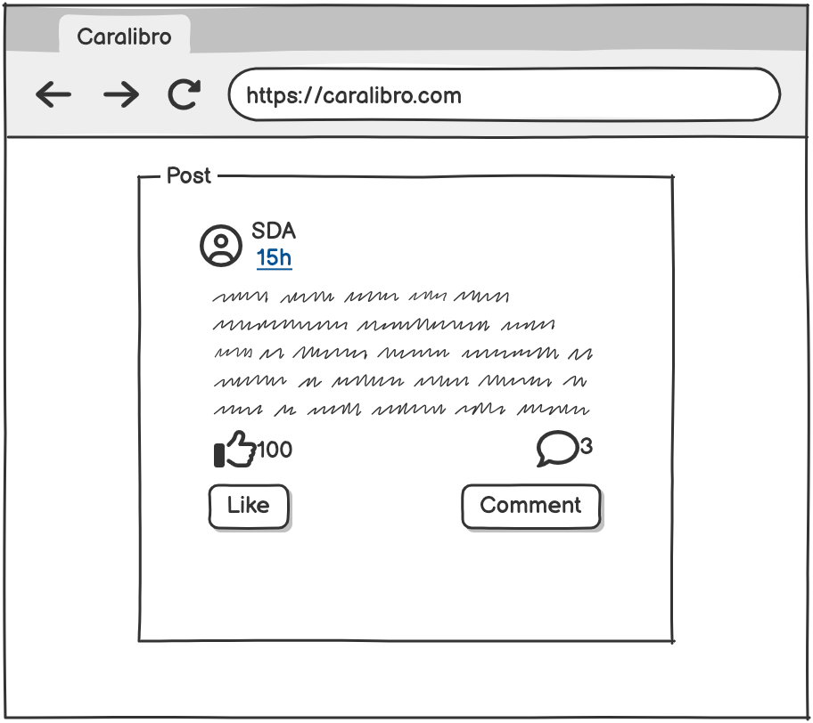
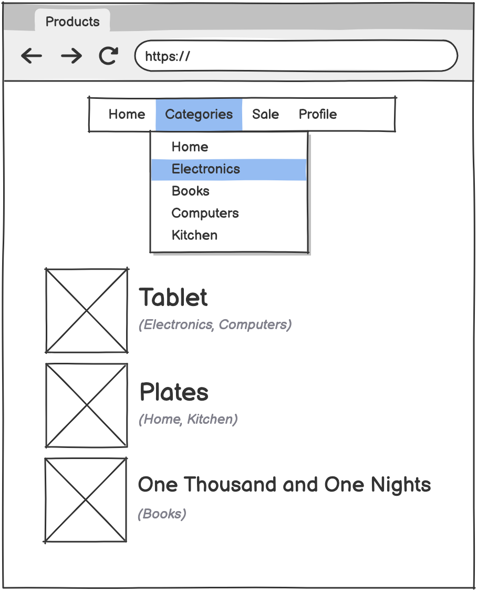
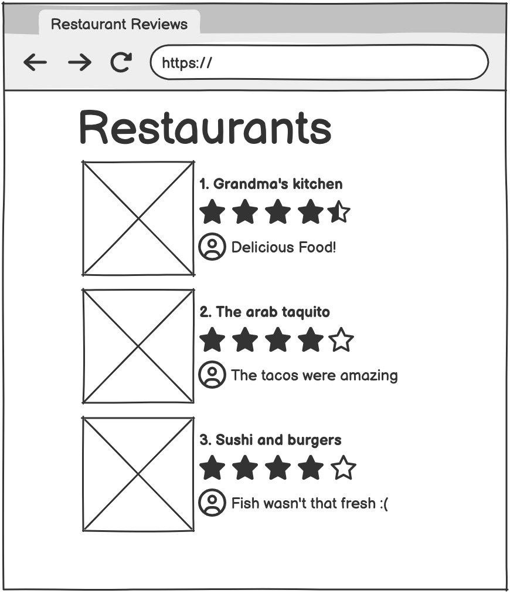
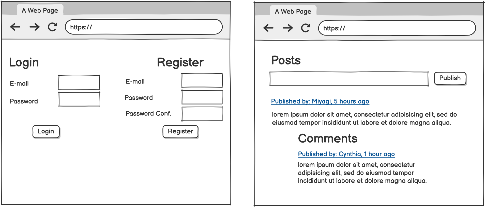

## Morning Activity - Cynthia Challenges!

### ERD Exercise PART 1
Based on the following wireframes, create an ERD to represent each of the application's database.

### ERD Exercise Part 2:
Imagine you are a developer creating a music application, and you need to design its database (erd). The application will have songs, users, artists, and each user’s favorite songs.

**Task:**
Create an ERD (Entity-Relationship Diagram) to represent the application’s database. The diagram should track users, songs, artists, and users’ favorite songs.

**Instructions:**
- Make sure to define primary keys, foreign keys, and relationships:
- One artist can have many songs.
- One user can have many favorite songs.
- One song can be favorited by many users.

