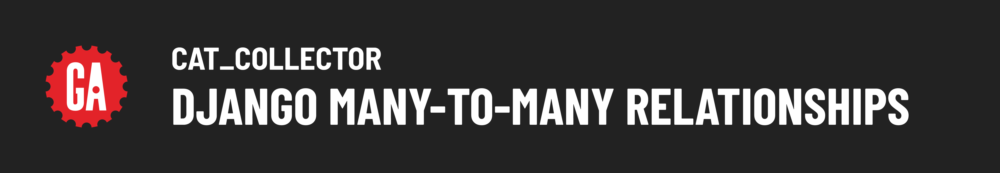

<!--  -->
# 

**Learning objective:** By the end of this lesson, students will be able to create and manage a many-to-many relationship between Cats and Toys using Django's built-in features.

## Many-to-Many Relationships in Relational Databases

In relational databases like those used by Django, creating many-to-many relationships between two entities requires an intermediary or join table. This join table, unlike in document-based databases like MongoDB, is essential for managing `M:M` relationships in SQL databases.

### The role of a join table

A join table acts as a bridge connecting two other tables by storing foreign keys that reference the primary keys of these tables. Each row in a join table represents a link between one entry in each of the connected tables.

For instance, if a `Cat` can play with many `Toys`, and each `Toy` can be used by many `Cats`, the join table will store pairs of foreign keys pointing to the respective entries in the `Cats` and `Toys` tables.


### Associating `Cats` with `Toys`

Now that we have set up full CRUD capabilities for the `Toy` model, our next step is to define a many-to-many relationship between `Cats` and `Toys`. This allows multiple cats to interact with multiple toys interchangeably.

When you associate a `Cat` with a `Toy`, you add a row to the join table containing the foreign keys of the cat and toy involved. In reverse, dissociating a `Cat` from a `Toy` simply involves removing the corresponding row from the join table, without deleting any records from the `Cat` or `Toy` tables themselves.

## Many-to-Many Relationship in Django

As usual, the Django framework handles a lot of the heavy lifting when it comes to working with many-to-many relationships between Models.

Forms and templates aside, all we need to do to implement a many-to-many relationship using Django is:

1. Add a `ManyToManyField` on one of the Models
2. Create the migration and migrate it to update the database

Django will ensure that a "hidden" join table is created that links the rows of the other two tables together.

Let's get started!

## Add a `ManyToManyField` on one side of the relationship

To create a `M:M` relationship between two models, we need to add a `ManyToManyField` on one of them.

When you add a `ManyToManyField` to one of your models, you also choose a name for the relationship. This name is used as the attribute through which you access related objects from that model.

Given that our application's focus is on `Cats`, we are more likely interested in a cat’s toys, than a toy’s cats, so we’ll add the new attribute to the `Cat` model and name it "toys":

```python
class Cat(models.Model):
    name = models.CharField(max_length=100)
    breed = models.CharField(max_length=100)
    description = models.TextField(max_length=250)
    age = models.IntegerField()
    # Add the M:M relationship
    toys = models.ManyToManyField(Toy)
```

> Tip: If you don't have your `Toy` model above your `Cat` model in `models.py`, you'll need to move it there now. This will correct any `toy not defined` server errors.

## Make and run the migration

Because we’ve made a change to a Model that impacts the database’s schema, we need to make a migration and migrate it to update the database:

First, make the migration:

```bash
python3 manage.py makemigrations
```

Then migrate the created migration to update the schema:

```bash
python3 manage.py migrate
```

Thats it, the relationship has been made! Now when we navigate to our new cat page we automatically see an option to add a toy in the new cat form. This means the connection was successful, however it's not the best user experience. What if we don't want to add a toy when creating a cat?

We need to make a small change to ensure this field isn't shown when a user is creating a cat.

Navigate to the `CatCreate` class in `main_app/views`:

Change the property:

```python
fields = '__all__'
```

to the following:

```python
fields = ['name', 'breed', 'description', 'age']
```

This ensures that only the listed fields are shown in the new cat form. We'll create a separate form for adding toys to cats in a later section.

## Displaying a list of all available toys

In this part of the lesson, we will display a list of all toys and provide an option to associate each toy with a cat. This will be achieved by adding an "Add" button next to each toy, which, when clicked, will link the toy to the cat.

### Update the view to include `toys`

First, update the cat_detail view in your `views.py` to fetch all toys from the database and pass them to the template:

```python
def cat_detail(request, cat_id):
    cat = Cat.objects.get(id=cat_id)
    toys = Toy.objects.all()  # Fetch all toys
    feeding_form = FeedingForm()
    return render(request, 'cats/detail.html', {
        'cat': cat,
        'feeding_form': feeding_form,
        'toys': toys  # Pass toys to the template
    })
```

This code ensures that all toys are available in the cats `detail` page template, enabling us to display them next to the cat's details.

### Modify the template to display `toys`

Now, let's update the `cats/detail.html` template to display each toy with an "Give Toy" button that will eventually link the toy to the cat.

Add the following `<section>` with the class "toys", below the existing `<section>` with the class "feedings":

```html
<section class="feedings">
  <!-- This is a long section -->
</section>

<section class="toys">
  <div class="subsection-title">
    <h2>Toys</h2>
    
    
    
  </div>
  <h3>Available Toys</h3>
  <div class="subsection-content">
    
      <div class="toy-container">
        <div class="color-block" style="background-color: {{ toy.color }}"></div>
        <p>{{ toy.color }} {{ toy.name }}</p>
        <form action="" method="post">
          
          <button type="submit" class="btn submit">Give Toy</button>
        </form>
      </div>
    
  </div>
</section>
```

In the code above:

- Each toy is being programmatically rendered with its `color` and `name` properties listed.

- Each toy is also being rendered with a simple form with a "Give Toy" button, which allows users to associate or "give" a toy to a cat.

- The form action will be linked to a URL that handles the association.

- The `action` attribute is currently empty, as we will implement this feature next once we create the `path` used to associate cats and toys.

After making these changes, your user interface will display a list of toys on the cat's detail page, each with an option to give the toy to the cat.

Take a moment to add toys if you don't see any listed!


## Associating cats and toys

Next, we will implement the functionality to link toys to cats using the many-to-many relationship we created earlier. This involves setting up a new view function that handles the association process when a user clicks the "Give Toy" button next to a toy in the cat's detail page.

### Define the URL pattern

First, we'll add a new URL pattern in the `urls.py` file. This URL will handle the association between a cat and a toy by capturing their respective `ids`.

To do this, the server needs to know the `id` of **both** the cat and the toy being associated:

```python
# New URL to associate a toy with a cat
path('cats/<int:cat_id>/associate-toy/<int:toy_id>/', views.associate_toy, name='associate-toy'),
```

This URL pattern includes two dynamic segments `cat_id` and `toy_id` which will capture the `id`s from the URL and pass them to the view function.

> This will cause an error with our server temporarily, because we have not created the view for this new path.

### Update the form action in the template

Next, modify the form in your `cat-detail.html` template to use this new URL. Ensure that the form's `action` attribute is set to the correct URL which will trigger the association when submitted:

```html
<form action="" method="post">
  
  <button type="submit" class="btn submit">Give Toy</button>
</form>
```

In this form, the `` template tag dynamically generates the correct URL based on the `ids` of the cat and the toy. This setup ensures that each "Give Toy" button properly associates its corresponding toy with the current cat.

> Note how we need to provide both `id`s as space-separated parameters in the order that they were defined in the path (first the cat’s id, then the toy’s).

### Create the association view function

Finally, create the view function in `views.py` that will execute the association between the cat and the toy using the `ids` passed from the form:

_You can add this function anywhere in your views file:_

```python
def associate_toy(request, cat_id, toy_id):
    # Note that you can pass a toy's id instead of the whole object
    Cat.objects.get(id=cat_id).toys.add(toy_id)
    return redirect('cat-detail', cat_id=cat_id)
```

Now that we have our view function in place, we can test making associations from the UI by verifying the association in the admin portal.
Give a cat a couple toys and head to the admin portal!

[http://127.0.0.1:8000/admin](http://127.0.0.1:8000/admin)

Toys associated with each cat will appear highlighted in the admin portal.


> Biscuit has been given the two toys highlighted in the toy list.

## Displaying a list of associated `Toys`

Now that we have verified we are able to make associations between cats and toys, we should display them back to the user.

Consider the following user story:

_As a User, when viewing the detail page of a cat, I want to see a list of toys the cat has and be able to give more toys the cat doesn’t already have_

Displaying a cat’s toys is just a matter of updating `/cats/detail.html` to show `cat.toys.all`:

```html
<section class="toys">
  <div class="subsection-title">
    <h2>Toys</h2>
    
    
    
  </div>

  <!-- displaying a cat's toys -->
  <h3>{{ cat.name }}'s Toys</h3>
  <div class="subsection-content">
     
      
        <div class="toy-container">
          <div class="color-block" style="background-color: {{ toy.color }}"></div>
          <a href="">
            <p>A {{ toy.color }} {{ toy.name }}</p>
          </a>
        </div>
       
    
      <p class="no-toys">{{cat.name}} doesn't have any toys!</p>
    
  </div>

  <h3>Available Toys</h3>
  <div class="subsection-content">
    <!-- Available toys here -->
  </div>
</section>
```

In this section, the template checks whether the cat has any associated toys. If the cat has no toys, a message stating `"{{cat.name}} doesn't have any toys!"` is displayed. If the cat does have toys, we use a loop to list each toy that belongs to the cat.

### Removing toys from the available list

As an improvement to the user experience, you might consider removing toys from the available list once they have been given to a cat. To do this we will make a slight change to the way toys are being filtered in the `cat_detail` view before rendering the data in the `detail` template.

In the `cat_detail` view function we will replace the code to get all toys:

```python
toys = Toy.objects.all()
```

And update this function to the following:

```python
def cat_detail(request, cat_id):
    cat = Cat.objects.get(id=cat_id)

    # Only get the toys the cat does not have
    toys_cat_doesnt_have = Toy.objects.exclude(id__in = cat.toys.all().values_list('id'))

    feeding_form = FeedingForm()
    return render(request, 'cats/detail.html', {
        'cat': cat,
        'feeding_form': feeding_form,
        'toys': toys_cat_doesnt_have  # send those toys
    })
```

This line of code is designed to fetch all toys that are not currently associated with that specific cat. It's useful for displaying only those toys that the cat could still "acquire" or be associated with.

It's a bit complex looking, so let's break down each part:

- The first half of this expression `Toy.objects.exclude(id__in = ` retrieves all Toy objects that do not have an `id` that is in the list of associated toy `ids`. The `exclude()` method is the opposite of `filter()`, which means it will get all toys except those whose `ids` are listed in the previous query. The `id__in` is a field lookup that checks if the `id` field of the `Toy` model is within the provided list.

- The second half of this expression `cat.toys.all().values_list('id')` retrieves a list of `ids` for all the toys associated with a specific cat. This is done by first accessing all toy instances linked to the cat through the many-to-many relationship `(cat.toys.all())`, and then narrowing the data down to just the `ids` of these toys using `values_list('id')`.

Now we can update the "Available Toys" section in the UI to only show available toys, and a conditional message once a cat has collected all the available toys:

```html
<h3>Available Toys</h3>
<div class="subsection-content">
   
    
      <div class="toy-container">
        <div class="color-block" style="background-color: {{ toy.color }}"></div>
        <a href="">
          <p>A {{ toy.color }} {{ toy.name }}</p>
        </a>
        <form action="" method="post">
          
          <button type="submit" class="btn submit">Give toy</button>
        </form>
      </div>
     
  
    <p class="all-toys">{{cat.name}} already has all the available toys 🥳</p>
  
</div>
```

Looking great!


## 🎓 You Do: Remove a `Toy` from a `Cat`

Implement the following user story:

_As a User, when viewing the detail page for a cat, I want to be able to remove a toy from that cat_

This process will be nearly identical to what we did when adding an association, but with the opposite action.

1. Define the URL.

   ```python
   path('cats/<int:cat_id>/remove-toy/<int:toy_id>/', views.remove_toy, name='remove-toy'),
   ```

2. Create the view function. _Hint: Check out Django's **[.remove()](https://docs.djangoproject.com/en/5.0/ref/models/relations/#django.db.models.fields.related.RelatedManager.remove)** method._

   ```python
   def remove_toy(request, cat_id, toy_id):
       # Look up the cat
       # Look up the toy
       # Remove the toy from the cat
       return redirect('cat-detail', cat_id=cat.id)
   ```

3. Update the template. Where should this form be added?

   ```html
   <form action="" method="post">
     
     <button type="submit" class="btn btn-danger">Remove Toy</button>
   </form>
   ```

<!--  -->