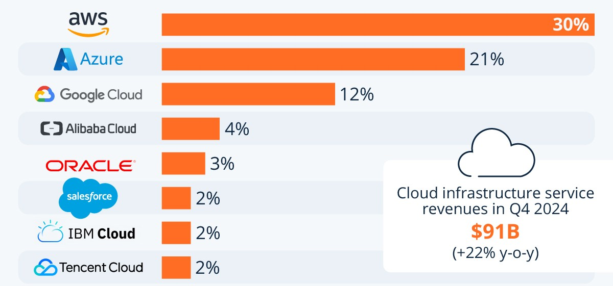

# Cloud Basics

## What is the Cloud?

The cloud describes accessing servers and computers over the internet to perform computing operations, such as storage, running applications, networking, security, and more.

Typically, this is done through major cloud providers, operating massive data centers.

For example, AWS operated 3.5 million square meters of data centers and office space to run over 1.4 million servers as of 2014, and that number has only grown.

  

---

## Why Cloud? (Concepts and Benefits)

### Scalability and Elasticity

Cloud allows you to add or remove resources based on demand.

> Suppose you have a server that can handle 50 requests per minute. If suddenly you get 200 requests per minute, cloud infrastructure can automatically create more server instances to handle the load, and shut them down once demand drops, saving money.

> An online ticketing site sees a sudden spike when concert tickets go live. Cloud scaling adds extra servers instantly so the site doesn't crash and handles the requests without slowing down the user experience.

### Portability

Cloud environments allow you to quickly move applications across vendors, making it easy to test, compare prices, and avoid vendor lock-in.

> In the pre-cloud era, switching providers required moving physical servers, which was expensive and time-consuming.

> A startup launches in AWS but later finds better pricing on Google Cloud. Portability lets them migrate easily without major redesign.

### Fault Tolerance

Applications can be deployed across multiple regions. If one region goes offline (e.g., Middle East servers), the application can automatically shift to another (e.g., UK servers) to maintain uptime.

>A banking app must stay online 24/7. If one cloud server fails and if the whole system crashes, it could cost millions in lost revinue, debugging, compensation, etc. Instead, traffic reroutes to backup servers in another region instantly.

### Pay-As-You-Go

You only pay for what you use. This dynamic scaling controls runtime costs compared to static physical servers that may sit idle.

> A weather forecasting app sees massive use during hurricane season but very little after. Hypothetically, if they maintained services for the busy season, even during the quiet season, they could be charged $50,000 a year, but because they reduce their resources during the quiet season, they only pay $15,000 a year.

### Global Reach

Deploy applications around the world, ensuring fast response times for users everywhere.\

>Netflix delivers videos world wide with very low latency. If they only had servers in the US, customers in Europe, Asia, ME, and Africa would all experience substantial delays in service and streaming time, but because you can deploy servers all throughout each continent, you can keep latency to a minimum.

### Core Message

Cloud is fundamentally about **reliability** and **flexibility**.

---

## XaaS (Everything as a Service)

Cloud services fall into key categories:

### IaaS (Infrastructure as a Service)

Provision raw computing resources: servers, storage, and networking.

> A game studio needs a Linux server to run a game server. They rent a VM on AWS instead of buying expensive hardware and hiring a team of network and mainframe engineers to maintain the server. This saves them time and money allowing them to focus on development and delivery.   

### PaaS (Platform as a Service)

Provide a managed environment to develop and deploy applications.

> Platforms like Heroku, Google App Engine, or Azure App Service. These services automatically deploy your app when you push updates to GitHub.

> A team building a web app uses Heroku so they can focus on coding and let the platform handle updates, scaling, and server maintenance.

### SaaS (Software as a Service)

Deliver full software solutions over the internet.

> A small business uses Google Workspace (Gmail, Drive, Docs) without having to install or maintain anything locally.

> A company uses a real time translator to speak with clients internationally, they do not have to run or maintain any of the software.

### Additional Specialized Services

- **FaaS** (Function as a Service): Run serverless functions (e.g., AWS Lambda)
- - > An online shop uses a Lambda function to send a "Thank you" email automatically after every purchase. 
- **DBaaS** (Database as a Service): Managed databases (e.g., Amazon RDS)
- - > A mobile app uses Firebase's database without needing to manage database servers.
- **BaaS** (Backend as a Service): Prebuilt backend services (e.g., Firebase)
- - > A new app developer quickly sets up user authentication with Firebase BaaS instead of coding it from scratch.

---

## Popular Cloud Providers

### Amazon Web Services (AWS)

- Market leader (over 30% of the internet).
- Greatest breadth of services.
- Powers companies like Netflix, Twitch, and Amazon itself.

> When you stream a movie on Netflix, the video and recommendations are powered by AWS cloud services.

### Microsoft Azure

- Deep integration with Windows Server, Active Directory, C#, and Visual Studio.
- Great for enterprise solutions and consistent developer experience.

> A Fortune 500 company uses Azure to manage employee accounts, emails, and app hosting all in one ecosystem.

### Google Cloud Platform (GCP)

- Focus on AI/ML services.
- Invented Kubernetes.
- Strong for data analytics and open-source collaboration.

> A startup specializing in AI uses Google Cloud's machine learning APIs to train models faster.

  
---

## Common Cloud Usages

### Storage

Use services like AWS S3 to store photos, videos, datasets, or backups without worrying about running out of space.

> A mobile app stores user profile pictures in S3 buckets.

### Compute

Rent virtual machines (VMs) to host APIs, websites, and applications.

> A news site runs its backend server on a virtual machine that scales based on traffic.

### Serverless Functions

Run short-lived scripts (e.g., a payment processing function) without needing to maintain a constantly running server.

> When someone submits a contact form, a serverless function sends a confirmation email instantly.

### Databases

Managed database services (e.g., AWS RDS, Google Cloud SQL) allow you to scale and optimize databases without server maintenance.

### Containers

Deploy applications using containerization tools like Docker or Kubernetes, making it easy to scale and orchestrate complex systems.

> A software team builds a web app in Docker containers so it works exactly the same across all environment, and can easily be deployed with the same behavior

---

## Quick Recap

- Cloud computing focuses on **flexibility**, **scalability**, and **cost efficiency**.
- It offers "as a service" solutions ranging from raw infrastructure (IaaS) to complete software platforms (SaaS).
- Popular providers include AWS, Azure, and GCP.
- Common use cases include storage, compute, serverless, databases, and containers.

Cloud computing allows businesses to focus on innovation rather than infrastructure, making it a cornerstone of modern software engineering.

---

## Activity: Cloud Use Case Brainstorm

**Instructions:**

1. Choose one of the following applications:
   - Instagram
   - Amazon
   - Netflix
2. Brainstorm or research **how that application might use cloud computing**.
   - What services (Storage, Compute, Database, Serverless) would be most important?
   - What benefits (Scalability, Global Reach, Fault Tolerance) would be critical?
3. Send us what you come up with!
4. Optional! Build a Flow Diagram of how these services would communicate.